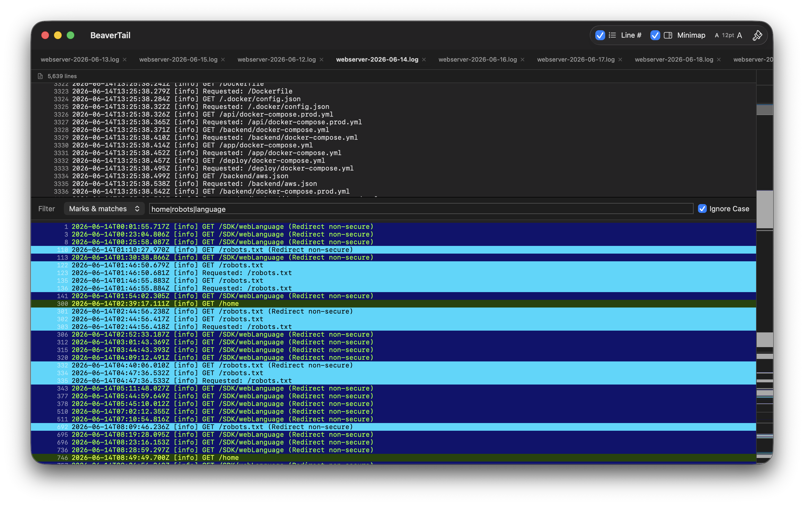
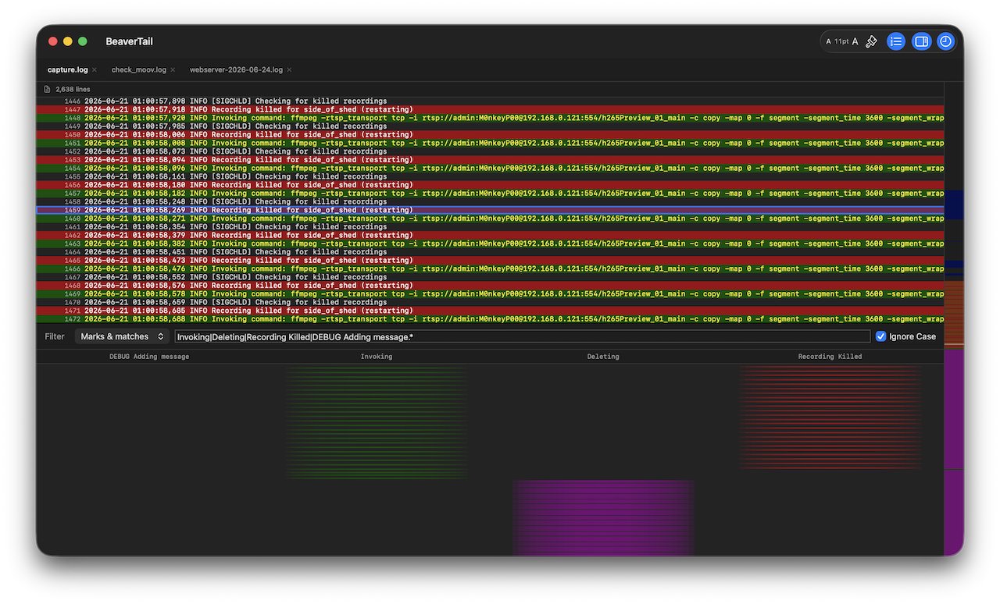

# BeaverTail Log Analyser

BeaverTail is a 100% AI-generated log filtering application, created mostly using the Claude Opus 4.8 AI model.
It is a native macOS application written in Swift, intended for Apple Silicon (ARM-based Macs), though it also supports
compiling for Intel-based Macs.

The application follows a Model-View-ViewModel (MVVM) architecture, designed by AI under my direction. In summary, AI
created the user interface; the icons; the architecture; the roadmap (including converting the original architecture to
be fully MVVM); the unit and component tests; the UI tests and all of the source code. AI also integrated the Vectorscan
library — the ARM port of the Hyperscan library — to optimize regular expression handling. This makes the application
extremely fast at filtering large logs by utilizing SIMD (Single Instruction, Multiple Data) processing.

If any proof was ever needed that AI will make coding obsolete for software engineers, this is it!

Download the latest [Installer Disk Image](https://github.com/wgibson75/beavertail/releases/latest/download/BeaverTail.dmg) for Apple Silicon.
